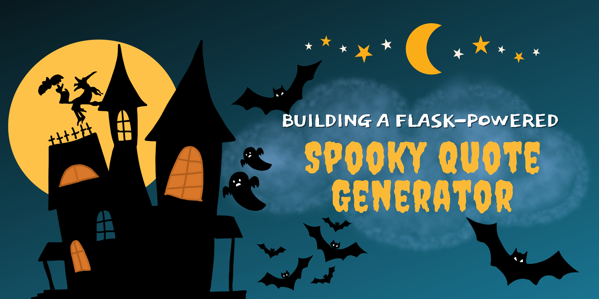

# Spooky Quote Generator | Fask App

I’m a big fan of Halloween and a self-proclaimed horror film connoisseur. 😎 But I am also an aspiring Cloud Engineer, and I needed a way to make working on projects and learning more interesting. (Yes, I have ADHD.) So, I decided to combine my two favorite things, Halloween & Tech, to create this project that definitely gave me the chills.

This Spooky Quote Generator is a simple Flask app that provides the end-user with a random spooky quote each time they click the button. But here’s where the horror comes in… I tasked myself with not only building the Flask app but also having the app retrieve the quotes from a DynamoBD table using an API. The API was created using AWS API Gateway and a Lambda function.

I also created a Python script that loads the DynamoBD table with quotes I pulled from the internet. Not an easy feat… I had to learn how to use the Pandas library to work with Excel sheets and extract the data I needed, and also Boto3 to work with the DynamoDB table. To take it just one step further, I decided to deploy the infrastructure using IaC (AWS CDK)!

The infrastructure repo for this project can be found [here](https://www.github.com/JamesSimpsonIII/spooky-infrastructure). 
